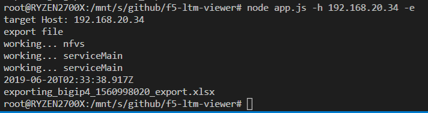

f5-ltm-viewer
=============

requirements:
-------------
   - nodejs 10 LTS
   - ./user/creds.json
   - ./user/devices.json

usage:
------
flags:
    Required:
       - -h target host
       - -c credentials object to use
    Optional:
       - -e export csv
       - -v version

cli output
----------
.. code::

    node -h host -c bigip4

|

export to default path
----------------------

.. code::

    node -h host -c bigip4 -e 

|

export to specific path
----------------------

.. code::

    node -h 192.168.20.34 -c bigip4 -e ./exports/

|

